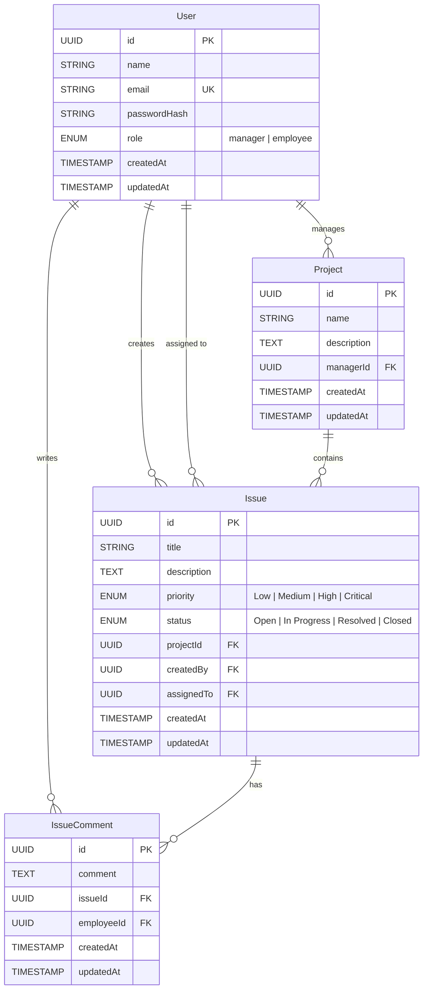

# 🏗️ ARCHITECTURE.md — Issue Tracker Application

## Table of Contents
- [Tech Stack](#tech-stack)
- [Why This Stack?](#why-this-stack)
- [Project Structure](#project-structure)
- [Database Schema](#database-schema)
- [API Endpoints](#api-endpoints)
- [Frontend Component Structure](#frontend-component-structure)
- [Real-Time Architecture](#real-time-architecture)
- [AI Integration](#ai-integration)
- [Authentication & Authorization](#authentication--authorization)
- [What I'd Improve With More Time](#what-id-improve-with-more-time)

---

## Tech Stack

| Layer | Technology |
|-------|-----------|
| **Frontend** | React 19 + Vite 7 |
| **Styling** | Vanilla CSS with CSS Custom Properties (Design System) |
| **Backend** | Node.js + Express 5 |
| **Database** | PostgreSQL + Sequelize ORM |
| **Real-Time** | Socket.IO (WebSockets) |
| **AI** | Google Gemini 2.5 Flash via `@google/generative-ai` |
| **Auth** | JWT (JSON Web Tokens) + bcrypt |
| **Drag & Drop** | @dnd-kit/core |
| **Charts** | Chart.js + react-chartjs-2 |

---

## Why This Stack?

### Frontend: React + Vite
- **React** — Industry standard for building interactive UIs. Component-based architecture makes it easy to build reusable UI pieces (modals, cards, tables).
- **Vite** — Lightning-fast dev server with HMR. Much faster than CRA for development iteration.
- **Vanilla CSS** — Full control over styling. CSS Custom Properties enable a design system with dark/light mode toggle via a single `data-theme` attribute swap. No Tailwind dependency bloat.

### Backend: Express + PostgreSQL + Sequelize
- **Express** — Lightweight, flexible, and the most popular Node.js framework. Easy to set up RESTful APIs.
- **PostgreSQL** — Robust relational database, perfect for structured data like issues, projects, and users with clear foreign key relationships.
- **Sequelize ORM** — Clean model definitions, automatic migrations via `sync({ alter: true })`, and easy relationship management (belongsTo, hasMany).

### Real-Time: Socket.IO
- **Why WebSockets?** — Dashboard and Kanban board need instant updates when issues change. Polling would introduce delays and unnecessary network load.
- **Socket.IO** — Built-in reconnection, fallback to long-polling, and room support. Integrates cleanly with Express.

### AI: Google Gemini
- **Gemini 2.5 Flash** — Fast response times, generous free tier, and excellent at summarization and Q&A tasks.
- **Context injection** — The chatbot loads all issues/projects as context, enabling accurate answers about team workload and project status.

---

## Project Structure

```
Assessment Project/
├── backend/
│   ├── config/
│   │   ├── mongo.config.js         # MongoDB config (unused, kept for reference)
│   │   └── postgres.config.js      # Sequelize PostgreSQL connection
│   ├── controllers/
│   │   ├── ai.controller.js        # AI chatbot & summary endpoints
│   │   ├── auth.controller.js      # Login & Register
│   │   ├── comment.controller.js   # Comment CRUD
│   │   ├── issue.controller.js     # Issue CRUD + CSV export + stats
│   │   └── project.controller.js   # Project CRUD
│   ├── middleware/
│   │   ├── auth.middleware.js       # JWT verification
│   │   └── role.middleware.js       # Role-based access (manager/employee)
│   ├── models/
│   │   ├── index.js                # Model relationships
│   │   ├── user.js                 # User model
│   │   ├── issue.js                # Issue model
│   │   ├── issueComment.js         # IssueComment model
│   │   └── projects.js             # Project model
│   ├── routes/
│   │   ├── ai.routes.js            # /api/ai/*
│   │   ├── auth.routes.js          # /api/auth/*
│   │   ├── comment.routes.js       # /api/comments/*
│   │   ├── issue.routes.js         # /api/issues/*
│   │   ├── project.routes.js       # /api/projects/*
│   │   └── user.routes.js          # /api/users/*
│   ├── services/
│   │   ├── ai.service.js           # Gemini AI integration
│   │   ├── auth.service.js         # Auth logic (hash, verify, JWT)
│   │   ├── comment.service.js      # Comment DB operations
│   │   ├── issue.service.js        # Issue DB operations + stats
│   │   └── project.service.js      # Project DB operations
│   ├── server.js                   # Express app + HTTP server + Socket.IO
│   ├── socket.js                   # Socket.IO initialization
│   └── .env                        # Environment variables
│
├── frontend/app/
│   ├── src/
│   │   ├── components/
│   │   │   ├── AIChatbot.jsx       # Floating AI chat widget
│   │   │   ├── AIChatbot.css
│   │   │   ├── CreateIssueModal.jsx  # Issue creation modal
│   │   │   ├── DashboardCharts.jsx   # Priority & Project charts
│   │   │   ├── Layout.jsx            # App shell (sidebar + topbar)
│   │   │   ├── Layout.css
│   │   │   └── ProtectedRoute.jsx    # Auth route guard
│   │   ├── context/
│   │   │   ├── AuthContext.jsx       # Auth state + JWT management
│   │   │   └── ThemeContext.jsx       # Dark/Light mode state
│   │   ├── hooks/
│   │   │   └── useSocket.js          # Socket.IO React hook
│   │   ├── pages/
│   │   │   ├── DashboardPage.jsx     # Main dashboard with stats + table
│   │   │   ├── IssueDetailPage.jsx   # Issue view + comments + AI summary
│   │   │   ├── KanbanPage.jsx        # Drag-and-drop Kanban board
│   │   │   ├── LoginPage.jsx         # Login form
│   │   │   ├── RegisterPage.jsx      # Registration form
│   │   │   └── ProjectsPage.jsx      # Projects CRUD + cards
│   │   ├── services/
│   │   │   └── api.js                # Axios API client + all endpoints
│   │   ├── App.jsx                   # Router + providers
│   │   ├── main.jsx                  # Entry point
│   │   └── index.css                 # Design system + global styles
│   └── index.html
│
└── docs/
    ├── README.md
    ├── ARCHITECTURE.md               # This file
    └── PROMPTS.md                    # AI prompt history
```

---

## Database Schema

### Entity Relationship Diagram



### Key Relationships
| Relationship | Type | Description |
|---|---|---|
| User → Project | One-to-Many | Manager owns/creates projects |
| User → Issue (creator) | One-to-Many | User creates issues |
| User → Issue (assignee) | One-to-Many | Manager assigns issues to users |
| Project → Issue | One-to-Many | Project contains issues |
| Issue → IssueComment | One-to-Many | Issue has discussion comments |
| User → IssueComment | One-to-Many | User writes comments |

---

## API Endpoints

### Authentication (`/api/auth`)
| Method | Endpoint | Description | Auth |
|--------|----------|-------------|------|
| POST | `/api/auth/register` | Register new user | ❌ |
| POST | `/api/auth/login` | Login, returns JWT | ❌ |

### Issues (`/api/issues`)
| Method | Endpoint | Description | Auth | Role |
|--------|----------|-------------|------|------|
| GET | `/api/issues` | List all issues (filterable) | ✅ | Any |
| POST | `/api/issues` | Create issue | ✅ | Employee, Manager |
| GET | `/api/issues/export/csv` | Download issues as CSV | ✅ | Manager |
| GET | `/api/issues/stats/status` | Issue counts by status | ✅ | Any |
| GET | `/api/issues/stats/priority` | Issue counts by priority | ✅ | Any |
| GET | `/api/issues/stats/project` | Issue counts by project | ✅ | Any |
| GET | `/api/issues/:id` | Get issue details | ✅ | Any |
| PUT | `/api/issues/:id` | Update issue (status, assignee) | ✅ | Manager |
| DELETE | `/api/issues/:id` | Delete issue | ✅ | Manager |
| POST | `/api/issues/:id/comment` | Add comment to issue | ✅ | Any |

### Projects (`/api/projects`)
| Method | Endpoint | Description | Auth | Role |
|--------|----------|-------------|------|------|
| GET | `/api/projects` | List all projects | ✅ | Any |
| POST | `/api/projects` | Create project | ✅ | Manager |
| GET | `/api/projects/:id` | Get project details | ✅ | Any |
| PUT | `/api/projects/:id` | Update project | ✅ | Manager |
| DELETE | `/api/projects/:id` | Delete project | ✅ | Manager |

### Comments (`/api/comments`)
| Method | Endpoint | Description | Auth |
|--------|----------|-------------|------|
| GET | `/api/comments/:issueId` | Get comments for issue | ✅ |
| POST | `/api/comments/:issueId` | Add comment | ✅ |
| DELETE | `/api/comments/:commentId` | Delete comment | ✅ |

### Users (`/api/users`)
| Method | Endpoint | Description | Auth |
|--------|----------|-------------|------|
| GET | `/api/users` | List all users | ✅ |

### AI (`/api/ai`)
| Method | Endpoint | Description | Auth |
|--------|----------|-------------|------|
| POST | `/api/ai/chat` | AI chatbot Q&A | ✅ |
| GET | `/api/ai/summarize-issue/:id` | AI issue summary | ✅ |
| GET | `/api/ai/summarize-comments/:id` | AI comment thread summary | ✅ |

---

## Frontend Component Structure

```
App.jsx
├── ThemeProvider (dark/light mode)
│   └── AuthProvider (JWT + user state)
│       └── BrowserRouter
│           ├── /login → LoginPage
│           ├── /register → RegisterPage
│           └── ProtectedRoute → Layout
│               ├── Sidebar (navigation + user info)
│               ├── Topbar (page title + theme toggle)
│               ├── AIChatbot (floating widget)
│               └── Outlet
│                   ├── / → DashboardPage
│                   │   ├── Stats Row (status cards)
│                   │   ├── DashboardCharts (Doughnut + Bar)
│                   │   ├── Toolbar (filters + search + CSV export)
│                   │   ├── Issues Table
│                   │   └── CreateIssueModal
│                   ├── /issues/:id → IssueDetailPage
│                   │   ├── Issue Header + Meta
│                   │   ├── Description Card
│                   │   ├── AI Summary Button
│                   │   ├── Comments Section + AI Summarize
│                   │   └── Sidebar (properties + actions)
│                   ├── /projects → ProjectsPage
│                   │   └── Project Cards Grid
│                   └── /kanban → KanbanPage
│                       ├── Toolbar (search + project filter)
│                       └── DndContext
│                           ├── Column: Open
│                           ├── Column: In Progress
│                           ├── Column: Resolved
│                           └── Column: Closed
```

---

## Real-Time Architecture

```
┌─────────────┐     WebSocket      ┌─────────────┐
│  Browser A   │ ◄──────────────► │   Server     │
│  (Dashboard) │                   │  Socket.IO   │
└─────────────┘                   └──────┬───────┘
                                         │
┌─────────────┐     WebSocket      ┌─────┴───────┐
│  Browser B   │ ◄──────────────► │   Express    │
│  (Kanban)    │                   │  Controllers │
└─────────────┘                   └─────────────┘
```

**Flow:**
1. User A creates/updates/deletes an issue
2. Controller calls service → saves to DB
3. Controller emits Socket.IO event (`issues:changed`, `projects:changed`, `comments:changed`)
4. All connected clients receive the event
5. Frontend `useSocket` hook triggers re-fetch of relevant data
6. UI updates instantly across all open browsers

---

## AI Integration

### Architecture
```
Frontend                    Backend                     Google Gemini
┌──────────┐   POST /ai/chat   ┌───────────┐   API Call   ┌──────────┐
│ AIChatbot │ ──────────────► │ ai.service │ ──────────► │ Gemini   │
│           │ ◄────────────── │            │ ◄────────── │ 2.5 Flash│
└──────────┘    reply          └───────────┘    response   └──────────┘
```

### Features
1. **Chatbot** — Loads all issues + projects as context, enables natural language Q&A
2. **Issue Summary** — Generates 2-3 sentence summary including status, assignee, and key discussion points
3. **Comment Summary** — Summarizes discussion threads, highlighting decisions and action items

---

## Authentication & Authorization

- **JWT-based** — Token stored in `localStorage`, sent via `Authorization: Bearer <token>` header
- **Role-based access control** — Two roles: `manager` and `employee`

| Action | Employee | Manager |
|--------|----------|---------|
| View issues | ✅ | ✅ |
| Create issues | ✅ | ✅ |
| Assign issues | ❌ | ✅ |
| Update issue status | ❌ | ✅ |
| Delete issues | ❌ | ✅ |
| Create projects | ❌ | ✅ |
| Drag Kanban cards | ❌ | ✅ |
| Export CSV | ❌ | ✅ |
| Add comments | ✅ | ✅ |
| AI features | ✅ | ✅ |

---

## What I'd Improve With More Time

1. **Testing** — Add unit tests (Jest) for services and integration tests for API endpoints. Add React Testing Library tests for key components.

2. **Error Handling** — Implement a global error boundary on frontend and a centralized error handler middleware on backend with proper error codes.

3. **Pagination** — The issues list and comments currently load all records. Add cursor-based or offset pagination for better performance at scale.

4. **File Attachments** — Allow file uploads on issues and comments (screenshots, logs). Use S3 or local storage with multer.

5. **Email Notifications** — Send emails on issue assignment, status changes, and new comments using SendGrid or Nodemailer.

6. **Activity Log** — Track all changes to issues (status transitions, assignment changes) in a dedicated audit table with timestamps.

7. **Search** — Implement full-text search with PostgreSQL's `tsvector` for faster and smarter search across issues and comments.

8. **Caching** — Add Redis caching for frequently accessed data like stats and project lists to reduce database load.

9. **CI/CD** — Set up GitHub Actions for automated linting, testing, and deployment to a cloud provider.

10. **Deployment** — Dockerize the app and deploy to AWS/GCP with a production-grade PostgreSQL instance, HTTPS, and environment-based config.
